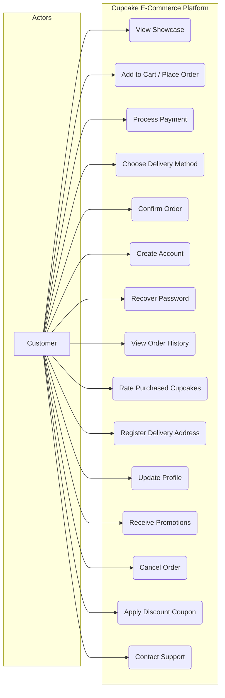
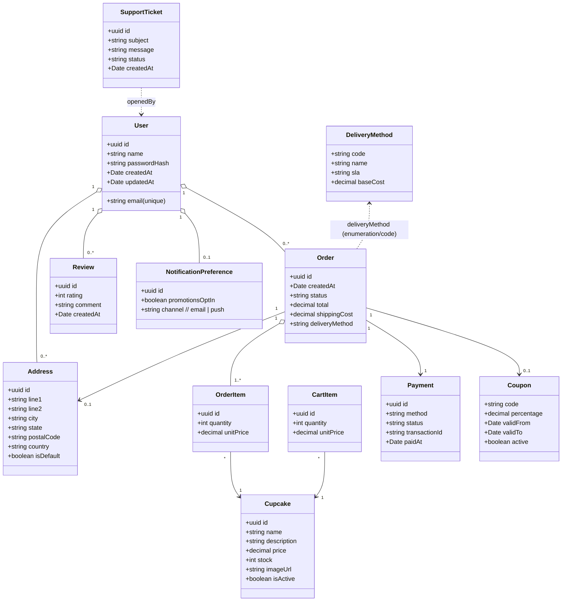
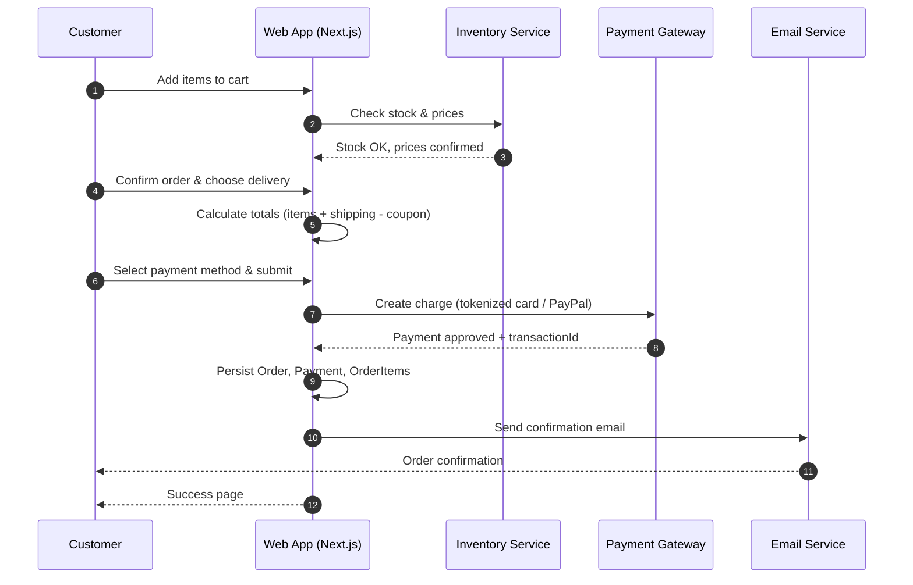
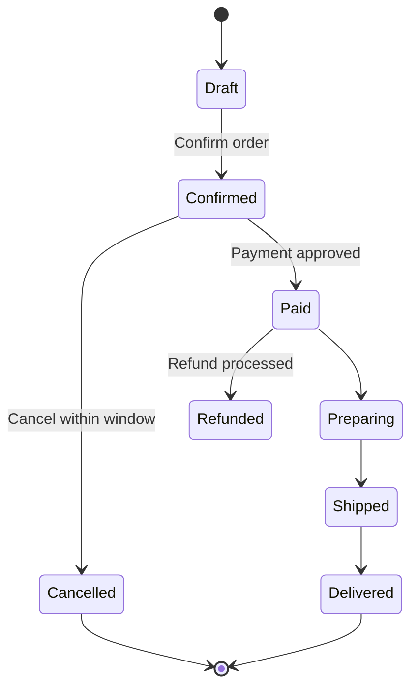
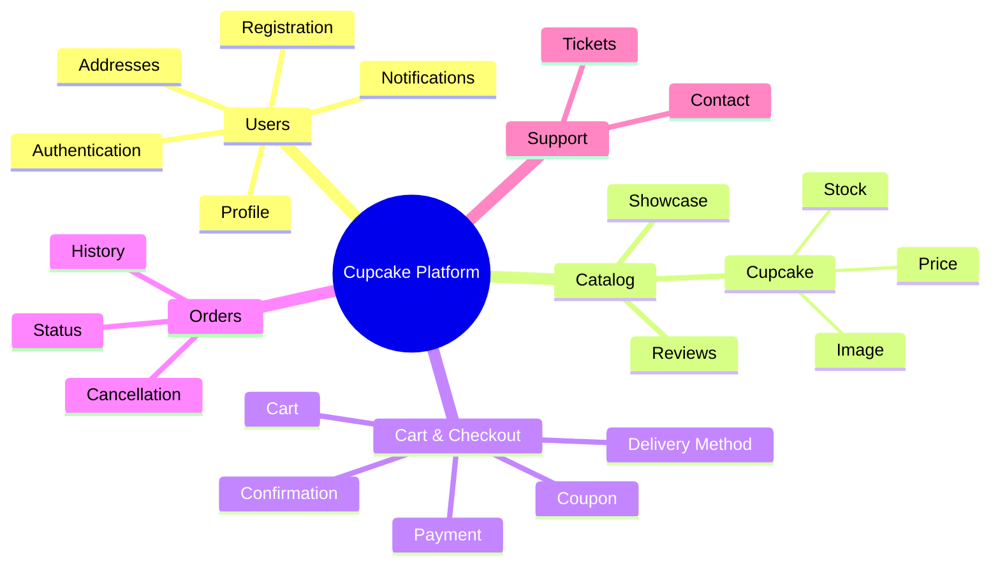
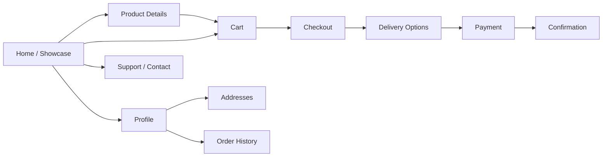
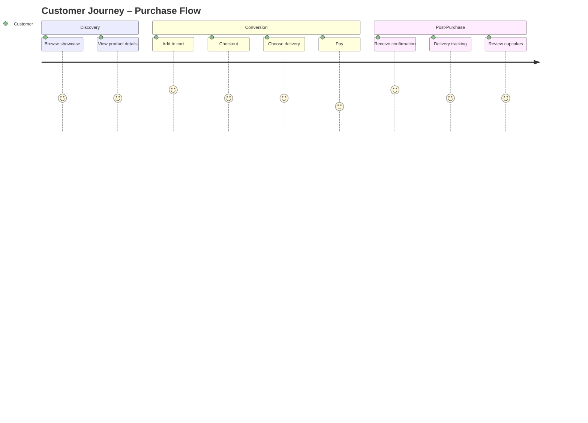

# Software Engineering Project – Cupcake E‑Commerce Platform

**Author:** Diego Dos Santos Câmara  
**RGM:** 36377333

> This Markdown consolidates the full project content in English, with structured sections for LLMs and developers.  
> Diagrams are embedded using Mermaid (class, sequence, mindmap, journey, and flowcharts) and simple ASCII wireframes.

---

## Situation 1: Understanding the Business

### User Stories

#### **US001 – View Cupcake Showcase**

**Requester:** Customer  
**Action:** As a customer, I want to view the virtual showcase to choose available cupcakes.  
**Comments:** The showcase must be visually appealing.

**Acceptance Criteria**

- CA#1: The showcase must display at least 10 cupcakes with photos and descriptions.

**Business Rules**

- RN#1: Only available cupcakes should appear in the showcase.

**Non‑Functional Requirements**

- RNF#1: The page must load in less than 3 seconds.

**Priority:** A · **Story Points:** 5

---

#### **US002 – Place Cupcake Order**

**Requester:** Customer  
**Action:** As a customer, I want to add cupcakes to my shopping cart.  
**Comments:** Each cupcake must have an **Add to Cart** button.

**Acceptance Criteria**

- CA#1: The cart must update in real time when adding or removing items.

**Business Rules**

- RN#1: Stock must be verified before allowing items in the cart.

**Non‑Functional Requirements**

- RNF#1: The interface must be responsive on mobile devices.

**Priority:** A · **Story Points:** 8

---

#### **US003 – Process Payment**

**Requester:** Customer  
**Action:** As a customer, I want to process payment for my cupcake order.  
**Comments:** Support credit card, debit card, and PayPal.

**Acceptance Criteria**

- CA#1: Allow selection of payment method.
- CA#2: Show visual confirmation of successful payment.

**Business Rules**

- RN#1: Payment only if the cart is not empty.
- RN#2: Validate payment data securely.

**Non‑Functional Requirements**

- RNF#1: Encrypt payment data.

**Priority:** B · **Story Points:** 3

---

#### **US004 – Choose Delivery Method**

**Requester:** Customer  
**Action:** As a customer, I want to choose among delivery methods.  
**Comments:** Include standard, express, and in‑store pickup.

**Acceptance Criteria**

- CA#1: Display all delivery options with prices and delivery times.

**Business Rules**

- RN#1: Delivery choice affects freight/shipping calculation.

**Non‑Functional Requirements**

- RNF#1: Delivery selection UI must be clear and intuitive.

**Priority:** B · **Story Points:** 5

---

#### **US005 – Confirm Order**

**Requester:** Customer  
**Action:** As a customer, I want to confirm my order before finalizing.  
**Comments:** Review all order details before confirmation.

**Acceptance Criteria**

- CA#1: Review screen showing items, prices, delivery address, and payment method.

**Business Rules**

- RN#1: Only confirm if all required fields are filled correctly.

**Non‑Functional Requirements**

- RNF#1: Confirmation page must be easy to read on mobile devices.

**Priority:** B · **Story Points:** 2

---

#### **US006 – Create User Account**

**Requester:** Customer  
**Action:** As a new user, I want to create an account to simplify future orders.  
**Comments:** Simple and fast.

**Acceptance Criteria**

- CA#1: Form with name, email, password, and confirm password.
- CA#2: Send confirmation email after submission.

**Business Rules**

- RN#1: Email must be unique.

**Non‑Functional Requirements**

- RNF#1: Mobile‑responsive form.

**Priority:** C · **Story Points:** 5

---

#### **US007 – Recover Password**

**Requester:** Customer  
**Action:** As a user, I want to recover my password if I forget it.  
**Comments:** Secure and easy to use.

**Acceptance Criteria**

- CA#1: “Forgot Password” option on login.
- CA#2: Send password reset link by email.

**Business Rules**

- RN#1: Reset link must expire after a defined period.

**Non‑Functional Requirements**

- RNF#1: Intuitive and secure interface.

**Priority:** C · **Story Points:** 3

---

#### **US008 – View Order History**

**Requester:** Customer  
**Action:** As a user, I want to view all my previous orders.  
**Comments:** Show status, date, and details.

**Acceptance Criteria**

- CA#1: Order history section in the user profile.

**Business Rules**

- RN#1: Only show orders of the logged‑in user.

**Non‑Functional Requirements**

- RNF#1: Fast loading even with many orders.

**Priority:** D · **Story Points:** 3

---

#### **US009 – Rate Purchased Cupcakes**

**Requester:** Customer  
**Action:** As a customer, I want to rate cupcakes I’ve purchased.  
**Comments:** Helps other customers decide.

**Acceptance Criteria**

- CA#1: After order confirmation, invite user to rate products.

**Business Rules**

- RN#1: Ratings must be tied to the specific product.

**Non‑Functional Requirements**

- RNF#1: Simple and intuitive rating UI.

**Priority:** D · **Story Points:** 2

---

#### **US010 – Register Delivery Address**

**Requester:** Customer  
**Action:** As a user, I want to register one or more delivery addresses.

**Acceptance Criteria**

- CA#1: Form to enter a complete address.

**Business Rules**

- RN#1: Support multiple addresses per user.

**Non‑Functional Requirements**

- RNF#1: Validate address format.

**Priority:** D · **Story Points:** 3

---

#### **US011 – Update Profile Information**

**Requester:** Customer  
**Action:** As a user, I want to update my profile (name, email, addresses).

**Acceptance Criteria**

- CA#1: Section for editing user data.

**Business Rules**

- RN#1: Email must remain unique even after change.

**Non‑Functional Requirements**

- RNF#1: Validate data accuracy.

**Priority:** D · **Story Points:** 2

---

#### **US012 – Receive Promotional Notifications**

**Requester:** Customer  
**Action:** As a user, I want to receive notifications about new promotions and offers.  
**Comments:** Email or push notifications.

**Acceptance Criteria**

- CA#1: User can opt in or out.

**Business Rules**

- RN#1: Notify only users who opted in.

**Non‑Functional Requirements**

- RNF#1: Easy to disable notifications.

**Priority:** D · **Story Points:** 3

---

#### **US013 – Cancel Order**

**Requester:** Customer  
**Action:** As a customer, I want to cancel my order before delivery.  
**Comments:** There is a cancellation time window.

**Acceptance Criteria**

- CA#1: Cancel option in the order history.

**Business Rules**

- RN#1: Cancellation allowed only up to a defined point in the delivery process.

**Non‑Functional Requirements**

- RNF#1: Clear and straightforward cancellation process.

**Priority:** D · **Story Points:** 3

---

#### **US014 – Apply Discount Coupon**

**Requester:** Customer  
**Action:** As a customer, I want to apply a discount coupon during checkout.

**Acceptance Criteria**

- CA#1: Field to enter the coupon code during checkout.

**Business Rules**

- RN#1: Coupon must be valid and applicable to the order.

**Non‑Functional Requirements**

- RNF#1: Immediate feedback about validity.

**Priority:** D · **Story Points:** 2

---

#### **US015 – Contact Support**

**Requester:** Customer  
**Action:** As a user, I want to contact support via multiple channels.

**Acceptance Criteria**

- CA#1: Page or section with email, phone, and contact form.

**Business Rules**

- RN#1: Keep contact info up to date.

**Non‑Functional Requirements**

- RNF#1: Support area must be quickly accessible from anywhere.

**Priority:** E · **Story Points:** 3

---

## Product Backlog

| ID    | User Story                        | Points | Priority |
| ----- | --------------------------------- | ------ | -------- |
| US001 | View virtual cupcake showcase     | 5      | A        |
| US002 | Add cupcakes to cart              | 8      | A        |
| US003 | Process payment                   | 3      | B        |
| US004 | Choose delivery method            | 5      | B        |
| US005 | Confirm order                     | 2      | B        |
| US006 | Create account                    | 5      | C        |
| US007 | Recover password                  | 3      | C        |
| US008 | View order history                | 3      | D        |
| US009 | Rate purchased cupcakes           | 2      | D        |
| US010 | Register delivery address         | 3      | C        |
| US011 | Update profile info               | 2      | C        |
| US012 | Receive promotional notifications | 3      | D        |
| US013 | Cancel order                      | 3      | D        |
| US014 | Apply discount coupon             | 2      | D        |
| US015 | Contact support                   | 3      | E        |

---

## Task Breakdown

| ID    | User Story       | Tasks                                                                                          | Hours   |
| ----- | ---------------- | ---------------------------------------------------------------------------------------------- | ------- |
| US001 | View Showcase    | 1) Design UI (4h) · 2) Fetch data (3h) · 3) Optimize loading (2h)                              | **9h**  |
| US002 | Place Order      | 1) Design cart (4h) · 2) Real‑time updates (6h) · 3) Stock check (3h) · 4) Responsiveness (2h) | **15h** |
| US003 | Process Payment  | 1) Design UI (3h) · 2) Integrate APIs (6h) · 3) Show confirmation (2h) · 4) Encrypt (2h)       | **13h** |
| US004 | Choose Delivery  | 1) Design UI (4h) · 2) Shipping calc (3h) · 3) Intuitive UI (2h)                               | **9h**  |
| US005 | Confirm Order    | 1) Review screen (3h) · 2) Validate fields (2h) · 3) Mobile readability (2h)                   | **7h**  |
| US006 | Create Account   | 1) Form (3h) · 2) Check email (2h) · 3) Send email (3h) · 4) Mobile (2h)                       | **10h** |
| US007 | Recover Password | 1) Add option (2h) · 2) Send link (4h) · 3) Intuitive flow (2h)                                | **8h**  |
| US008 | View History     | 1) Design UI (3h) · 2) Fetch orders (3h) · 3) Optimize (2h)                                    | **8h**  |
| US009 | Rate Cupcakes    | 1) Prompt (2h) · 2) Link to product (2h) · 3) Simple UI (2h)                                   | **6h**  |
| US010 | Register Address | 1) Form (3h) · 2) Multiples (3h) · 3) Validate (2h)                                            | **8h**  |
| US011 | Update Profile   | 1) UI (2h) · 2) Check email (2h) · 3) Validate (2h)                                            | **6h**  |
| US012 | Promotions       | 1) Opt‑in (2h) · 2) Send (4h) · 3) Disable (2h)                                                | **8h**  |
| US013 | Cancel Order     | 1) Button (2h) · 2) Logic (3h) · 3) Clear process (2h)                                         | **7h**  |
| US014 | Apply Coupon     | 1) Field (2h) · 2) Validate (3h) · 3) Feedback (2h)                                            | **7h**  |
| US015 | Contact Support  | 1) Page (3h) · 2) Sync info (2h) · 3) Ensure access (2h)                                       | **7h**  |

---

## Situation 2: UML & Behavioral Artifacts (in Markdown)

### 2.1 Use‑Case Overview (Mermaid Flowchart)



> Note: Mermaid does not natively support "use‑case" ovals; the flowchart approximates the high‑level actor‑to‑use‑case view.

---

### 2.2 Expanded Use‑Cases (Structured)

#### **US001 – View Cupcake Showcase**

- **Actor:** Customer
- **Preconditions:** System online with cupcakes registered.
- **Postconditions:** Available cupcakes are displayed.
- **Main Flow:**
  1. Customer opens the app.
  2. System displays at least 10 cupcakes.
  3. Customer views photos and descriptions.
- **Alternate:**  
  a) No products available → show “No products at the moment.”

#### **US002 – Place Cupcake Order**

- **Actor:** Customer
- **Preconditions:** Authenticated (or guest checkout allowed).
- **Postconditions:** Items added to cart.
- **Main Flow:** Choose cupcakes → Add to Cart → Stock verified → Cart updated.
- **Alternate:** Out‑of‑stock → show alert and block action.

#### **US003 – Process Payment**

- **Actor:** Customer
- **Preconditions:** Order confirmed.
- **Postconditions:** Payment completed.
- **Main Flow:** Select payment → Enter data → Send to gateway → Success response finalizes order.
- **Alternate:** Invalid data → show error; Payment refused → retry.

_(US004–US015 follow the same structure as above.)_

---

### 2.3 Class Diagram (Mermaid)



---

### 2.4 Sequence Diagram – “Happy Path” Checkout



---

### 2.5 State Diagram – Order Lifecycle



---

## Situation 3: Prototypes, Maps & Wireframes (in Markdown)

### 3.1 Concept Map (Mermaid Mindmap)



---

### 3.2 Navigational Map (Mermaid Flowchart)



---

### 3.3 User Journey (Mermaid Journey Diagram)



---

### 3.4 Wireframes (ASCII – Key Screens)

#### Showcase (Home)

```
+--------------------------------------------------------------+
|  Header: Logo | Search [____] | Cart (0) | Profile           |
+--------------------------------------------------------------+
|  Filters: [All] [Chocolate] [Vegan] [Gluten-free] [Promo]    |
+--------------------------------------------------------------+
|  [Card]  Img  Name     $Price   (Add to Cart)   ★★★★☆ (120)  |
|  [Card]  Img  Name     $Price   (Add to Cart)   ★★★☆☆ ( 45)  |
|  ... at least 10 cards ...                                   |
+--------------------------------------------------------------+
|  Footer: Links | Support | Terms | Privacy                   |
+--------------------------------------------------------------+
```

#### Cart

```
+---------------------------------------------+
| Cart                                        |
+---------------------------------------------+
| Item | Qty [ - 2 + ] | Unit | Subtotal | ✕  |
| Item | Qty [ - 1 + ] | Unit | Subtotal | ✕  |
+---------------------------------------------+
| Coupon [_______] (Apply)                    |
| Shipping:  [Standard ▼]  Cost: $X           |
| Total: $XXX.XX                              |
| (Checkout)                                  |
+---------------------------------------------+
```

#### Checkout

```
+-------------------+   +--------------------+
| Delivery Address  |   | Payment            |
|  [Select/Add ▼]   |   |  Method: [Card▼]   |
|  Street ...       |   |  Name on Card      |
|  City/ZIP ...     |   |  Number / Exp / CVV|
+-------------------+   +--------------------+
| Order Summary: Items / Shipping / Coupon / Total            |
| (Confirm Order)                                             |
+-------------------------------------------------------------+
```

#### Confirmation

```
+---------------------------------------------+
|  Order #ABC123  ✅ Paid                     |
|  Delivery: Express (ETA: 2 days)            |
|  Email sent to you@example.com              |
|  (Track Order)  (Continue Shopping)         |
+---------------------------------------------+
```

#### Profile / Order History / Support

```
+----------------+    +------------------------+
| Profile        |    | Order History          |
| Name, Email    |    | #ABC123  Paid  Details |
| Addresses [ ]  |    | #DEF456  Shipped ...   |
| Notifications  |    | ...                    |
+----------------+    +------------------------+

+---------------------------------------------+
| Support / Contact                           |
|  Email, Phone, Contact Form                 |
|  (Submit)                                   |
+---------------------------------------------+
```

---

## Implementation Notes (Next.js + Drizzle + Supabase – optional)

- **Auth & DB:** Supabase Auth; Drizzle ORM for schema & migrations.
- **Schema:** Reflects the class diagram (users, addresses, cupcakes, orders, order_items, payments, coupons, reviews, notification_prefs, support_tickets).
- **Security:** Encrypt PII at rest where appropriate; tokenize payment; validate inputs; rate‑limit critical endpoints.
- **Performance:** Cache showcase list; lazy‑load images; use incremental static regeneration if applicable.
- **Accessibility:** Semantic HTML, keyboard nav, focus states, ARIA roles; color‑contrast compliance.

---

## Summary

This document provides a **complete, LLM‑friendly** specification, including **user stories, backlog, tasks, UML/behavioral diagrams, maps, journey, and wireframes** — all directly in Markdown with Mermaid/ASCII so it renders in modern MD viewers and can be parsed by dev tools.
